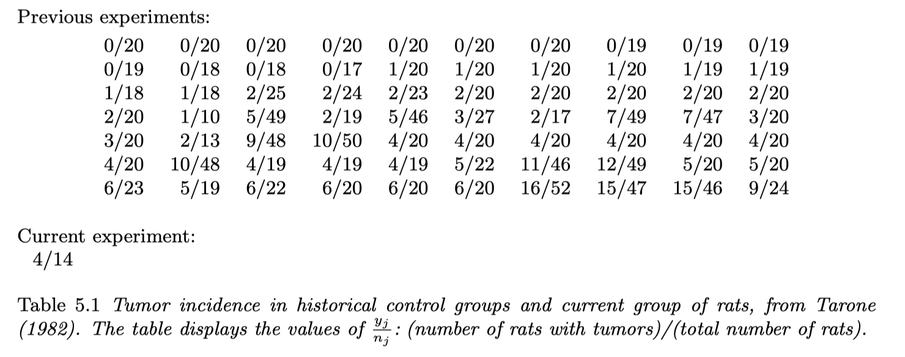
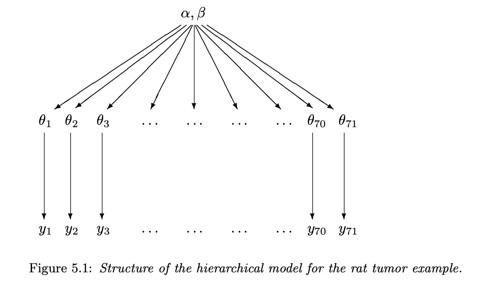
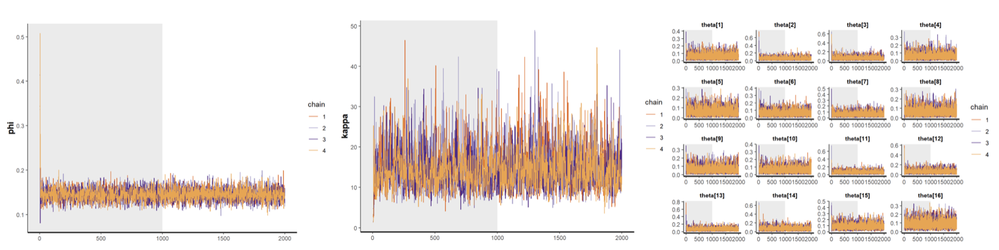
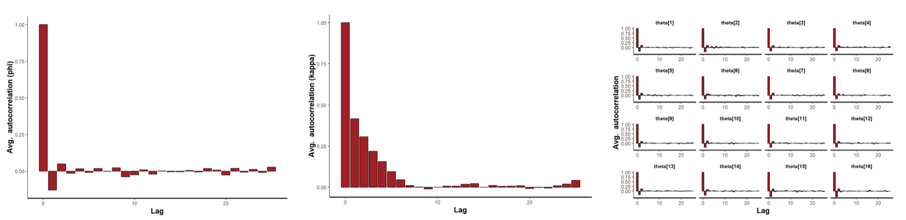
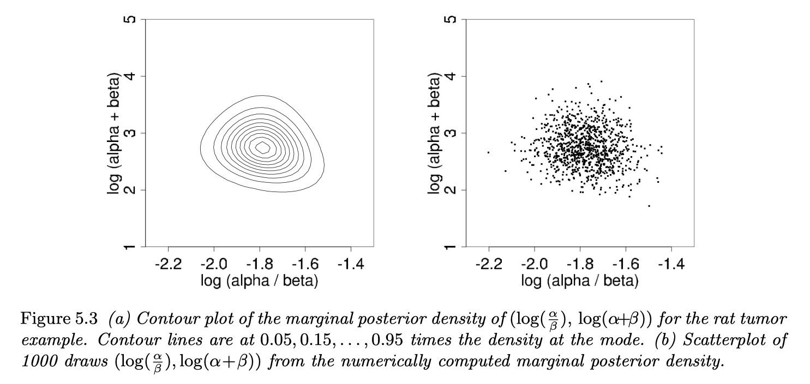
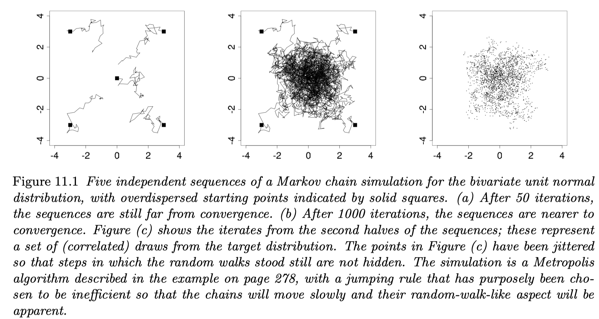

```{r setup, include=FALSE}
knitr::opts_chunk$set(echo = TRUE, warning = FALSE, message = FALSE)
```

<!-- do not show code using `echo = FALSE` option -->

```{r load libraries, message = FALSE}
require(tidyverse)
require(rstan)
require(loo)
```

# Data


> In the rat tumor example, the historical data were in fact a set of observations of tumor incidence in 70 groups of rats (Table 5.1). In the $j$th historical experiment, let the number of rats with tumors be $y_j$ and the total number of rats be $n_j$. We model the $y_j$’s as independent binomial data, given sample sizes $n_j$ and study-specific means $\theta_j$. Assuming that the beta prior distribution with parameters $(\alpha, \beta)$ is a good description of the population distribution of the $\theta_j$’s in the historical experiments, we can display the hierarchical model schematically as in Figure 5.1, with $\theta_{71}$ and $y_{71}$ corresponding to the current experiment.




Now, load data as follows:
```{r load data, message = FALSE}
rat_tumors_df <- read_csv("../src/rat-tumors.csv", comment = "#")
rat_tumors_df
```

# Inference

## Model

### Complete Pooling

$\newcommand{\bino}{\textrm{Binomial}}$
$\newcommand{\unif}{\textrm{Uniform}}$

$$
\begin{align*}
  p(y_j|\theta) &= \bino(y_j|n_j, \theta), \\
  p(y|\theta) &= \prod_{j=1}^N p(y_j|\theta), \\
  p(\theta) &= \unif(\theta|0, 1) = 1 \\
\end{align*}
$$

### No Pooling

$$
\begin{align*}
  p(y_j|\theta_j) &= \bino(y_j|n_j, \theta_j), \\
  p(y|\theta) &= p(y_j|\theta_j), \\
  p(\theta_j) &= \unif(\theta_j|0,1), \\
  p(\theta) &= \prod_{j=1}^N p(\theta_j).
\end{align*}
$$

### Partial Pooling

#### Tumor Incidence Rates (BDA 5.3)

$$
\begin{align*}
  p(y_j|\theta_j) &= \bino(y_j|n_j, \theta_j), \\
  p(y|\theta) &= \prod_{j=1}^N p(y_j|\theta_j), \\
  p(\theta_j|\alpha, \beta) &= \textrm{Beta}(\theta_j|\alpha, \beta), \\
  p(\theta|\alpha, \beta) &= \prod_{j=1}^N p(\theta_j|\alpha, \beta), \\
  \alpha = \kappa& \phi, \quad \beta = \kappa (1-\phi), \\
  p(\phi) &= \unif(\phi|0, 1), \\
  p(\kappa) &= \textrm{Pareto}(\kappa|1, 0.5) \propto \kappa^{-1.5} \\
\end{align*}
$$
$$
\begin{align*}
\kappa = \alpha + \beta, \\
\phi = \alpha / \beta \\
\end{align*}
$$


#### Log Odds of Tumor Incidence Rates (BDA 5.4)

$$
\begin{align*}
  p(y_j|\theta_j) &= \bino(y_j|n_j, \theta_j), \\
  p(y|\theta) &= \prod_{j=1}^N p(y_j|\theta_j), \\
  \alpha_j &= \textrm{logit}(\theta_j) = \log\left(\frac{\theta_j}{1-\theta_j}\right), \\
  p(\alpha_j|\mu, \sigma) &= N(\alpha_j|\mu, \sigma), \\
  p(\mu) &= N(\mu|-1, 1), \\
  p(\sigma) &= 2N(\sigma|0, 1)\textrm{I}(\sigma>0).
\end{align*}
$$


## Results

```{r load fitted models}
load("../src/fits_stan.Rdata")
```

> Convergence check is done only for the hierarchical model as an example.

### Diagnostics for Convergence
> After checking for covergence with traceplot and acf plot, details in Computation (Part3), fitted models can directly used for inferences about the parameters such as $\phi$, $\kappa$, $\theta$, $\alpha$, $\beta$, and any other quantities of interest. Judging by the following plots, it seems the model converged well, so we proceed to the inference! Note that all the following inferences are based on samples generated from parameters' posterior distribution.

Trace Plot



Auto Corrleation Function (ACF) Plot



### Parameter Inference

```{r}
# phi
stan_plot(fit_rats_hier, pars = "phi", show_density = TRUE)
# kappa
stan_plot(fit_rats_hier, pars = "kappa", show_density = TRUE)
# theta[1] to theta[16]
stan_plot(fit_rats_hier, pars = paste0("theta[",1:16,"]"), show_density = TRUE)
```

plot $\log(\alpha/\beta)$ vs $\log(\alpha + \beta)$
```{r plot fig 5.3} 
## extract alpha and beta with ‘permuted = TRUE’
fit_ss <- extract(fit_rats_hier, permuted = TRUE) # fit_ss is a list
## list fit_ss should have elements with name ‘alpha’, ‘beta’, ‘lp__’
hyperparam <- fit_ss %>%
  data.frame() %>%
  select("phi", "kappa") %>%
  transmute(alpha = kappa * phi, beta = kappa*(1-phi))

hyperparam %>%
  mutate(id = row_number()) %>%
  ggplot(aes(x = log(alpha/ beta), y =log(alpha + beta))) +
  geom_point(size = 1/2) +
  lims(y = c(1, 5)) +
  theme(aspect.ratio = 1)
```

Note that above plot is similar to figure 5.3 in BDA


### Customized Inference
> In addition to the inference on parameters, we can also infer the quantities of interest. In Stan, this can be implemented by declaring quantities of interest in ["generated quantities" block](https://mc-stan.org/docs/2_18/reference-manual/program-block-generated-quantities.html). Stan automatically provides full Bayesian inference by producing draws from the posterior distribution of any calculated event probabilities, predictions, or statistics. 
Different quantities of interest have been declared in our 4 models: e.g for pooled model, posterior p-val for max, mean test, $\theta_{1}$, $\theta_{33}$, $\theta_{54}$, $\theta_{71}$, and probability of any $\theta$ greater than 0.35 is declared and retrieved.

```{r}
pars_to_print <- c("p_max", "p_mean",
                   "theta[1]", "theta[33]", "theta[54]", "theta[71]",
                   "some_ability_gt_350");
```

Inference for Complete Pooling model:
```{r}
print(fit_rats_pool, pars_to_print);
```

Inference for No pooling model:
```{r }
print(fit_rats_no_pool, pars_to_print);
```

Inference for hierarchical models:
```{r }
print(fit_rats_hier, c("phi", "kappa"));
print(fit_rats_hier_logit, c("mu", "sigma"))
```

# Data Analysis

## Model Checking (Bayesian p-values)
> Bayesian p-value(i.e.Posterior predictive p-values) has a direct definition as a probability which can be approximated using Monte Carlo methods

$$
\begin{equation}
p_{B}=\operatorname{Pr}\left[T\left(y^{\mathrm{rep}}\right) \geq T(y) | y\right]
\end{equation}
$$

$$
\begin{equation}
p_{B} \approx \frac{1}{M} \sum_{m=1}^{M} \mathrm{I}\left[T\left(y^{\mathrm{rep}(m)}\right) \geq T(y)\right]
\end{equation}
$$

> We generate a Bayesian p-value by comparing the simulated data test statistic with its value on the actual data. Unlike Frequentist p-values, the test statistics is not conditioned on point estimated θ. Instead, variation in accordance with the posterior distribution is allowed.
It is a measure of model (mis)fit, and values near 0 or 1 indicate a discrepancy between the model and the data.

```{r posterior predictive p-values}
pars_ppp <- c("p_max", "p_mean", "p_min")
(ppp_pool <- summary(fit_rats_pool, pars_ppp)$summary)
(ppp_no_pool <- summary(fit_rats_no_pool, pars_ppp)$summary)
(ppp_hier <- summary(fit_rats_hier, pars_ppp)$summary)
(ppp_hier_logit <- summary(fit_rats_hier_logit, pars_ppp)$summary)
result = 'hide' 
```

```{r ppp plotting}
# statistics
y_min <- min(y);
y_max <- max(y);
y_mean <- mean(y);
y_sd <- sd(y);

# function to calculate ppp and save as data frame
pvals_frame <- function(ss, model_name, M = length(ss$min_y_rep)) {
  df_pvals_min <- data.frame(list(test_stat = rep("min", M), 
                  replication = ss$min_y_rep), model = rep(model_name, M))
  df_pvals_max <- data.frame(list(test_stat = rep("max", M),
                  replication = ss$max_y_rep), model = rep(model_name, M))
  df_pvals_mean <- data.frame(list(test_stat = rep("mean", M),
                  replication = ss$mean_y_rep), model = rep(model_name, M))
  df_pvals_sd <- data.frame(list(test_stat = rep("sd", M),
                  replication = ss$sd_y_rep), model = rep(model_name, M))
  return(rbind(df_pvals_min, df_pvals_max, df_pvals_mean, df_pvals_sd))
}

# extract parameters from fitted models
ss_hier = extract(fit_rats_hier, permuted = TRUE)
ss_hier_logit = extract(fit_rats_hier_logit, permuted = TRUE)
ss_pool = extract(fit_rats_pool, permuted = TRUE)
ss_no_pool = extract(fit_rats_no_pool, permuted = TRUE)

# calculate ppp
df_pvals <- rbind(pvals_frame(ss_hier, "partial pool"),
  pvals_frame(ss_hier_logit, "partial (logit)"),
  pvals_frame(ss_pool, "complete pool"),
  pvals_frame(ss_no_pool, "no pool"))

# plotting
M = length(ss_hier$p_min)
post_test_stat_plot <- ggplot(df_pvals, aes(replication)) +
  facet_grid(model ~ test_stat) +
  geom_histogram(binwidth = 0.5, colour="black", size = 0.25, fill="white") +
  theme(axis.title.y = element_blank(),
        axis.text.y = element_blank(),
        axis.ticks.y = element_blank()) +
  xlab("value in replicated data set") +
  geom_vline(aes(xintercept = y_val),
             data = data.frame(y_val = rep(c(rep(y_min, M), rep(y_max, M),
                    rep(y_mean, M), rep(y_sd, M)), 4),
                    test_stat = df_pvals$test_stat,
                    replication = df_pvals$replication),
             colour = "blue", size = 0.25) +
  ggtitle("Posterior p-values")

post_test_stat_plot
```

## Model Comparison (WAIC)
> Several measures include AIC, BIC, DIC, WAIC, LOOCV etc. Here we show WAIC. Dependence of the bias correction on the parameter uncertainty in the posterior is more explicit and is recommended by Gelman.
"Compared to AIC and DIC, WAIC has the desirable property of averaging over the posterior distribution rather than conditioning on a point estimate. This is especially relevant in a predictive context, as WAIC is evaluating the predictions that are actually being used for new data in a Bayesian context." (Ch.7)

$$
\begin{aligned} \operatorname{lppd} &=\log \text { pointwise predictive density } \\ &=\log \prod_{i=1}^{n} p_{\text { post }}\left(y_{i}\right)=\sum_{i=1}^{n} \log \int p\left(y_{i} | \theta\right) p_{\text { post }}(\theta) d \theta \end{aligned}
$$

$$
\begin{equation}
p_{\mathrm{WAIC}}=\sum_{i=1}^{n} \operatorname{var}_{\mathrm{post}}\left(\log p\left(y_{i} | \theta\right)\right)
\end{equation}
$$

$$
\widehat{elppd}_{\mathrm{WAIC}}=\operatorname{lp} \mathrm{pd}-p_{\mathrm{WAIC}}
$$


```{r waic}
# extract log_likelihood
log_lik_no_pool <- extract_log_lik(fit_rats_no_pool, merge_chains = TRUE)
log_lik_pool <- extract_log_lik(fit_rats_pool, merge_chains = TRUE)
log_lik_hier <- extract_log_lik(fit_rats_hier, merge_chains = TRUE)
log_lik_hier_logit <- extract_log_lik(fit_rats_hier_logit, merge_chains = TRUE)

(waic_no_pool <- waic(log_lik_no_pool))
(waic_pool <- waic(log_lik_pool))
(waic_hier <- waic(log_lik_hier))
(waic_hier_logit <- waic(log_lik_hier_logit))
```

# Computation

> Model is fitted through iterative simulation, Markov Chain Monte Carlo (MCMC), but the process impose following problems, which can result in misleading inference if not attended. For more information on MCMC, please refer to [Bayes and Computation](https://github.com/StanKorea/events/blob/master/StanKoreaMeetup1_Seminar2_Bayes_and_Computation.pdf) slide from StanKorea Meetup1.

## Problems
Two problems need attention when using MCMC:

1. Unrepresentative simulations 

Simulations may be grossly unrepresentative of the target distribution if the iterations have not proceeded long enough.

2. Within-sequence correlation

Simulation inference from correlated draws is generally less precise than from the same number of independent draws.



## Solutions

Three solutions are suggested for the above problems:

1. Multi chain with different starting points

Design the simulation runs to allow effective monitoring of convergence by simulating multiple sequences with starting points dispersed throughout parameter space (Figure 11.1a). 

2. Simulate until ‘within’ variation roughly equals ‘between’ variation

Monitor the convergence of all quantities of interest by comparing variation between and within simulated sequences until ‘within’ variation roughly equals ‘between’ variation (Figure 11.1b). Only when the distribution of each simulated sequence is close to the distribution of all the sequences mixed together can they all be approximating the target distribution. 

3. Alter the algorithm
if the simulation efficiency is unacceptably low the algorithm can be altered (Sections 12.1,12.2)

In order to implement the solutions, 'warm-up' and 'thin' is used.

### Warm-up
> practice of discarding early iterations in Markov chain simulation

purpose: 

- diminish the influence of the starting values

- to make sure distributions of the simulated values θ_t are close to the target distribution, p(θ|y) for large enough t

in Stan:

- stan() > warmup = floor(iter/2) 

- discard the first half as a default, but different warm-up fractions can be appropriate depending on the context

### Thin
> keep every kth simulation draw from each sequence

purpose:

- avoid the dependence of the iterations in each sequence

in Stan:

- stan() > thin = 1

- if the sequences have reached approximate convergence, they can be directly used for inferences

## Checking for Convergence

### Trace Plot
```{r}
# alpha and beta
hyperparam[1:2000,] %>% # select the first chain
  mutate(iterations = row_number()+1000) %>% # add burn-in number
  reshape2::melt(id.vars = "iterations") %>%
  ggplot(aes(x = iterations, y = value)) + 
  facet_wrap(~variable, scale = "free_y") + 
  geom_line() +
  labs(title = "trace plot of alpha and beta")
```

### ACF
ACF for $\phi$, $\kappa$, $\theta$s
```{r autocorrelation plot}
# phi
stan_ac(fit_rats_hier, pars = "phi")
# kappa
stan_ac(fit_rats_hier, pars = "kappa")
# theta[1] to theta[16]
stan_ac(fit_rats_hier, pars = paste0("theta[",1:16,"]"), 
           ncol = 4)
```

ACF for $\alpha$ and $\beta$
```{r}
# alpha and beta
alpha_acf <- hyperparam[1:2000,]$alpha %>% # select the first chain
  acf(plot = FALSE) %>%
  with(data.frame(lag, acf))
beta_acf <- hyperparam[1:2000,]$beta %>% # select the first chain
  acf(plot = FALSE) %>%
  with(data.frame(lag, acf))

data.frame(lags = alpha_acf[,1], 
           alpha = alpha_acf[,2],
           beta = beta_acf[,2]) %>%
  reshape2::melt(id.vars = "lags") %>%
  ggplot(aes(x = lags, y = value)) + 
  facet_wrap(~variable, scale = "free_y") + 
  geom_hline(aes(yintercept = 0)) +
  geom_segment(mapping = aes(xend = lags, yend = 0)) +
  labs(y = "acf", title = "acf plot of alpha and beta")
``` 


# Appendix

## Source Code (R + stan)

You can download source codes to click following links

```{r source codes, echo=FALSE, message = FALSE}
library(kableExtra)
codes <- data.frame(
  File = c(
    "[pool.stan](../src/pool.stan)",
    "[no-pool.stan](../src/no-pool.stan)",
    "[hier.stan](../src/hier.stan)",
    "[hier-logit-centered.stan](../src/hier-logit-centered.stan)",
    "[hier-logit.stan](../src/hier-logit.stan)", 
    "[rat-tumors.R](../src/rat-tumors.R)"
  ),
  Description = c(
    "stan code for complete pooling model",
    "stan code for no pooling model",
    "stan code for partial pooling model (tumor incidence rates)",
    "stan code for partial pooling model (log odds; centered model)",
    "stan code for partial pooling model (log odds; non-centered model)",
    "R code for fittig stan models and saving output as Rdata"
  )
)
kable(codes, align=c('c','l'), escape=F) %>%
  kable_styling(bootstrap_options = c("striped","bordered"), full_width = T, position = "center") %>%
  collapse_rows(valign = 'middle')
```

This document is made based on Bob Carpenter's "Hierarchical Partial Pooling for Repeated Binary Trials" and StanKorea 1819 Winter BDA Study.

<!-- ## Output (HMC samples) -->